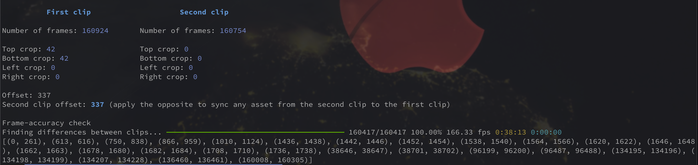

# frame-offset

## Description

This script programmatically finds the frame offset of 2 video files of the same movie. It relies on `FindDiff` from `lvsfunc`.

## Requirements

This script needs a working installation of `VapourSynth` with the `ffms2` indexer. It also requires the plugin `vapoursynth-autocrop installed`.

## Features

* Can measure the frame offset of two video files (having same resolution).
* Can handle cropped/uncropped files, as it will autocrop the 2 clips before processing.
* After having found a frame offset, it can optionally check whether the 2 clips are frame-accurate or not.

## Screenshot

